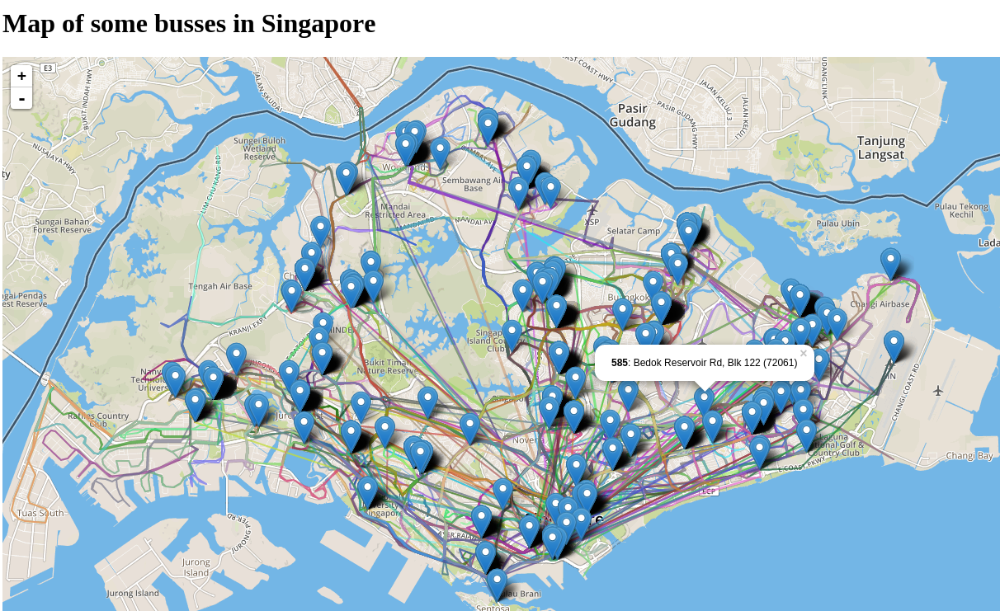
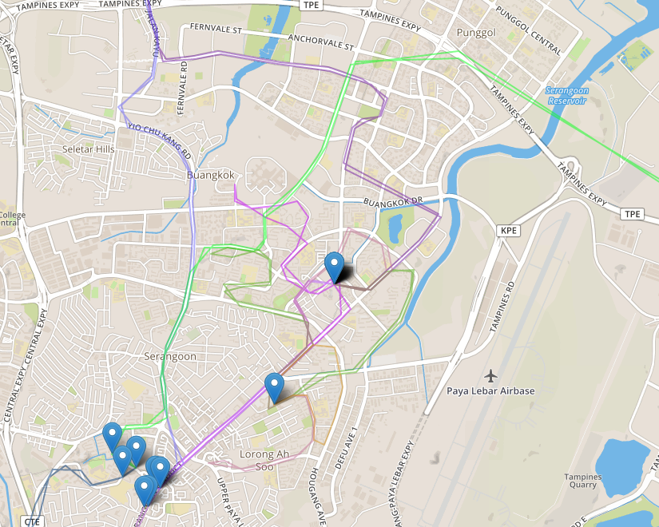

# README

Singapore public bus information
- Displays bus lines on a map
- REST API for buslines and busstops
- Search for buslines by coords, zipcode or busstop ID

Still very much work in progress.

## Frontend
/map
/map?max=20
/nightbusmap

## REST API

### Buslines resource

/api/buslines
/api/buslines/{busline_id}
/api/buslines/{busline_id}/busstopdetails
/api/buslines/{busline_id}/busstopdetails/{id}

### Busstopdetails resource

/api/busstopdetails
/api/busstopdetails/{id}

### Search buslines

*By attribute*
/api/search/buslines?attribute=night

*By area using coordinates, zip code or busstop id*
/api/search/buslines?busstation=1013&dist=700
/api/search/buslines?lat=1.312&long=103.906
/api/search/buslines?zipcode=424352

### Data import
The data is from the LTA API

A new import can be triggered via
/importdata

